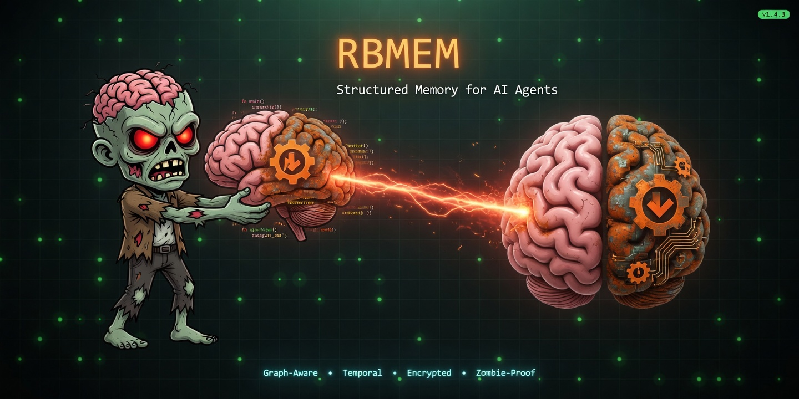
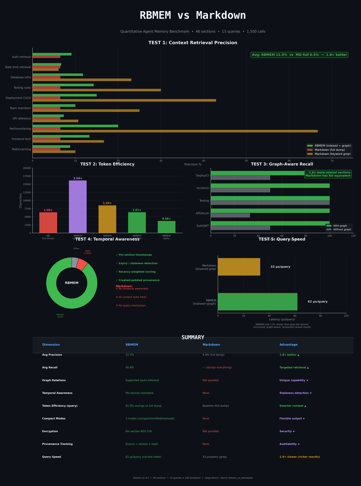
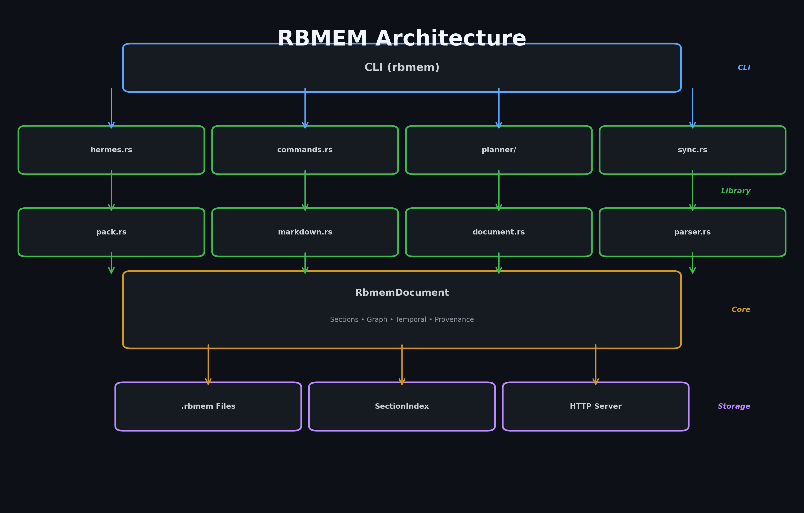

# RBMEM

<p align="center">
  
</p>

<p align="center">
  <a href="https://github.com/DJLougen/Rust-Brain/actions"></a>
  <a href="https://github.com/DJLougen/Rust-Brain/releases"></a>
  <a href="LICENSE"></a>
  <a href="https://www.rust-lang.org/"></a>
</p>

**Structured, temporal, graph-aware memory for AI agents.**

RBMEM is a file format and Rust library for managing agent memory with stable section paths, protected timestamps, hierarchical organization, graph relationships, and compact context output optimized for LLM consumption.

## Why RBMEM?

Markdown is human-readable but lacks structure. Agents need:

- **Stable identifiers** — Section paths like `agents.reader.capabilities` don't change when content is rewritten
- **Temporal awareness** — Tool-protected timestamps prevent models from inventing history
- **Graph relationships** — Explicit edges between concepts, not just prose links
- **Hierarchical inheritance** — Parent sections provide context to children
- **Compact output** — Minified views for context windows without losing metadata on disk
- **Provenance tracking** — Know where each section came from and when it was updated

## Features

- **Section-level operations** — Query, update, delete, encrypt individual sections
- **Graph-aware retrieval** — Follow relationships to find related context
- **SAT planning** — Built-in planner with Kissat/CaDiCaL support and DPLL fallback
- **AES-256-GCM encryption** — Per-section encryption for sensitive data
- **Hermes integration** — Native support for Hermes agent workflows
- **Markdown conversion** — Import from Markdown with automatic graph inference
- **Context packs** — Reusable context configurations via `.rbmempacks`
- **HTTP server** — Axum-based REST API for agent runtimes
- **Multiple output modes** — Canonical, compact, minified, JSON, YAML
- **Three-way merge** — Section-level conflict resolution

## Benchmark Results

RBMEM outperforms plain Markdown for agent memory tasks:

<p align="center">
  
</p>

| Metric | RBMEM | Markdown | Improvement |
|--------|-------|----------|-------------|
| **Precision** | 11.5% | 6.4% | **1.8× better** |
| **Recall** | 95.6% | 100% (full dump) | Targeted retrieval |
| **Graph-aware recall** | 100% | N/A | **Unique capability** |
| **Token efficiency** | 41.9% savings | baseline | Smarter context |
| **Query latency** | 62 µs | 33 µs (grep) | 1.9× slower, richer results |

*Benchmark: 46 sections, 15 queries, 100 iterations. See [benchmark methodology](benches/rbmem_vs_markdown.rs).*

## Quick Start

### Installation

```bash
git clone https://github.com/DJLougen/Rust-Brain.git
cd Rust-Brain
cargo build --release
```

The binary is at `target/release/rbmem`.

### Basic Usage

Create a memory file:

```bash
rbmem create memory.rbmem
```

Add a section:

```bash
rbmem update memory.rbmem \
  --section project.rules \
  --type list \
  --content "- Prefer small, tested changes"
```

Query for relevant context:

```bash
rbmem query memory.rbmem "project rules" --resolve --minified
```

### Agent Context

Get the smallest useful context for an LLM:

```bash
rbmem context memory.rbmem \
  --task "review this pull request" \
  --resolve --minified --graph-depth 1
```

Use context packs for repeatable workflows:

```bash
# Define in .rbmempacks
[pack: code_review]
include:
  - project.rules
  - memory.user.preferences
query: "pull request testing"
graph_depth: 1
mode: minified

# Load the pack
rbmem pack memory.rbmem code_review --resolve
```

## Architecture

<p align="center">
  
</p>

RBMEM is organized as a Rust library with a CLI wrapper:

- **CLI** (`main.rs`) — Command parsing and user interaction
- **Library modules** — Core functionality (hermes, planner, sync, pack, markdown)
- **Core** (`document.rs`) — Document model, sections, graph, temporal metadata
- **Storage** — `.rbmem` files, section index, HTTP server

See [docs/ARCHITECTURE.md](docs/ARCHITECTURE.md) for detailed design.

## Usage

### SAT Planning

Generate plans from goals, tasks, and constraints:

```bash
# Plan from explicit goal
rbmem plan "deploy agent release" --file memory.rbmem

# Derive goal from memory
rbmem plan --from-memory --file memory.rbmem

# Use external solver
rbmem plan "deploy" --solver kissat --proof --verify-proof
```

The planner writes results to `plans.<goal>.<timestamp>.*` sections with full provenance.

### Graph Relationships

RBMEM infers relationships from content and hierarchy:

```bash
# Infer relations during conversion
rbmem convert-from-md notes.md memory.rbmem --infer-relations

# Visualize the graph
rbmem export memory.rbmem --format mermaid
rbmem export memory.rbmem --format dot
```

Inference strategies: `off`, `explicit`, `balanced` (default), `aggressive`.

### Encryption

Protect sensitive sections with AES-256-GCM:

```bash
# Set encryption key
export RBMEM_ENCRYPTION_KEY="<base64-encoded-32-byte-key>"

# Encrypt a section
rbmem encrypt memory.rbmem --section secrets.api

# Query with decryption
rbmem query memory.rbmem "api credentials" --decrypt
```

Encrypted sections are skipped by default. Use `--decrypt` to include them.

### Markdown Sync

Keep Markdown files in sync with RBMEM:

```bash
# One-time conversion
rbmem sync ./notes ./memory --infer-relations

# Watch for changes
rbmem sync ./notes ./memory --watch --infer-relations
```

### Hermes Integration

Native support for Hermes agent workflows:

```bash
# Initialize Hermes memory
rbmem hermes init my-agent

# Load context for agent
rbmem hermes load my-agent.rbmem --resolve --minified

# Save agent updates
rbmem hermes save my-agent.rbmem --json '{
  "sections": [{
    "path": "memory.observations",
    "type": "hermes:memory",
    "content": "- User prefers concise responses",
    "mode": "append"
  }]
}'

# Plan with SAT solver
rbmem hermes plan my-agent.rbmem --goal "deploy release"
```

See [HERMES.md](HERMES.md) for complete agent integration guide.

### HTTP Server

Run RBMEM as a REST API:

```bash
rbmem serve --bind localhost:3000 --dir ./memories
```

Endpoints: `/health`, `/memories`, `/memories/:name/sections`, `/query`, `/context`, `/diff`, `/merge`, `/export`.

## Rust Library API

Use RBMEM as a Rust library:

```rust
use rbmem::{create, query, update, ContextOptions, SectionType};

// Create a memory file
create("memory.rbmem", CreateOptions {
    created_by: "agent".to_string(),
    purpose: "personal-agent-memory".to_string(),
    ..Default::default()
})?;

// Add a section
update("memory.rbmem", UpdateOptions {
    section: "agents.reader".to_string(),
    section_type: SectionType::Text,
    content: "Reads memory carefully.".to_string(),
    ..Default::default()
})?;

// Query for context
let context = query("memory.rbmem", "reader", ContextOptions {
    resolve: true,
    minified: true,
    graph_depth: 1,
    ..Default::default()
})?;
```

See [docs/API.md](docs/API.md) for complete API reference.

## Command Reference

| Command | Description |
|---------|-------------|
| `create <file>` | Create a new RBMEM document |
| `read <file>` | Read and display a document |
| `update <file> --section <path>` | Add or update a section |
| `delete-section <file> --section <path>` | Remove a section |
| `query <file> <text>` | Query for relevant sections |
| `context <file> --task <text>` | Assemble task-specific context |
| `pack <file> <name>` | Load a named context pack |
| `plan <goal>` | Generate a SAT plan |
| `convert-from-md <in> <out>` | Convert Markdown to RBMEM |
| `sync <md-dir> <rbmem-dir>` | Sync Markdown folder |
| `infer <file>` | Infer graph relations |
| `encrypt <file> --section <path>` | Encrypt a section |
| `decrypt <file> --section <path>` | Decrypt a section |
| `diff <before> <after>` | Compare two documents |
| `merge <base> <local> <remote>` | Three-way merge |
| `review <file>` | Validate and flag changes |
| `doctor <file>` | Check document health |
| `tree <file>` | Show section hierarchy |
| `timeline <file>` | Show temporal entries |
| `graph <file>` | Export graph (JSON/DOT) |
| `export <file> --format <fmt>` | Export to Mermaid/Cytoscape/GEXF |
| `serve --bind <addr>` | Start HTTP server |
| `hermes load <file>` | Load Hermes context |
| `hermes save <file> --json <payload>` | Save Hermes updates |
| `hermes plan <file> --goal <goal>` | Plan with Hermes |
| `hermes doctor <file>` | Check Hermes memory health |

Add `--format json` to any command for machine-readable output.  
Add `--resolve` to apply hierarchical inheritance.  
Add `--minified` for compact LLM context.  
Add `--graph-depth N` to include N levels of graph neighbors.

## File Format

RBMEM files are plain text with structured sections:

```rbmem
rbmem# RBMEM v1.4.0 - Rust-Brain Memory Format

meta:
  version: 1.4.0
  purpose: "agent-memory"
  generated_at: "2026-05-20T10:00:00Z"
  last_updated: "2026-05-20T10:00:00Z"

[SECTION: project.rules]
type: list
temporal:
  created_at: "2026-05-20T10:00:00Z"
  updated_at: "2026-05-20T10:00:00Z"
content: |
  - Prefer small, tested changes
  - Preserve user intent
[END SECTION]

[SECTION: agents.reader]
type: text
temporal:
  created_at: "2026-05-20T10:00:00Z"
  updated_at: "2026-05-20T10:00:00Z"
content: |
  Reads memory carefully and respects timestamps.
[END SECTION]
```

## Development

```bash
# Build
cargo build

# Test
cargo test --all-features

# Lint
cargo clippy --all-targets --all-features -- -D warnings

# Format
cargo fmt --check

# Benchmark
cargo bench --bench rbmem_vs_markdown -- --nocapture
```

## Contributing

Contributions are welcome! Please see [CONTRIBUTING.md](CONTRIBUTING.md) for guidelines.

## License

MIT License - see [LICENSE](LICENSE) for details.

## Roadmap

- [ ] Publish to crates.io
- [ ] Python bindings
- [ ] WebAssembly build
- [ ] Vector embeddings for semantic search
- [ ] Distributed sync protocol

## Acknowledgments

Built with [Rust](https://www.rust-lang.org/), [Clap](https://github.com/clap-rs/clap), [Axum](https://github.com/tokio-rs/axum), and [Petgraph](https://github.com/petgraph/petgraph).
