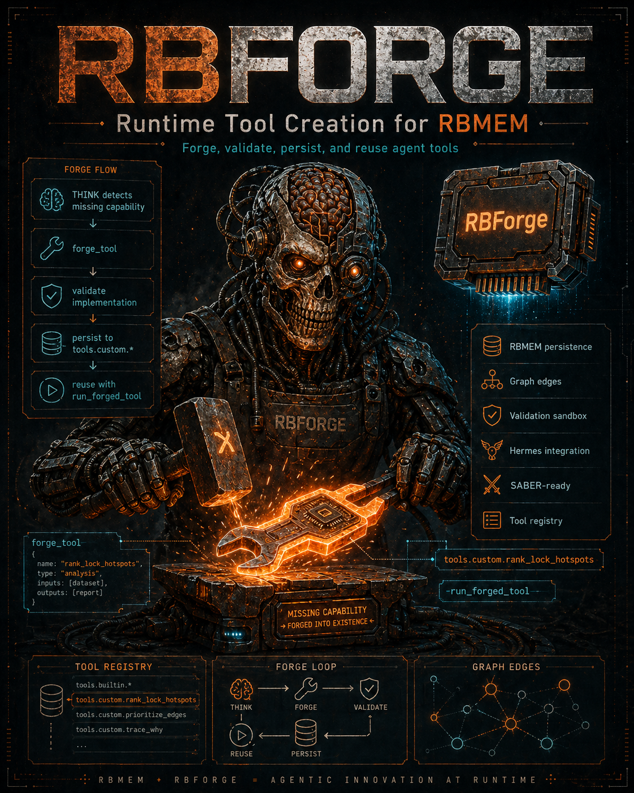

# RBForge



RBForge is a runtime tool creation system for agents. In plain terms: it lets an
agent write a small tool, validate that tool, save it into durable memory, and
reuse it later instead of solving the same problem from scratch every time.

RBForge stores tools in Rust-Brain memory files through the `rbmem` CLI from
[Rust-Brain](https://github.com/DJLougen/Rust-Brain). The saved tools live in
stable RBMEM paths such as `tools.custom.count_tracebacks`, are indexed in
`tools.registry`, and carry graph edges such as `depends_on`, `registered_in`,
`categorized_as`, and `used_in`.

RBForge `1.0.0` expects Rust-Brain/RBMEM `1.4.0` or newer. It uses JSON
diagnostics, context retrieval, graph export, encryption-aware reads, and server
mode when available instead of scraping minified text.

## Start Here

- New to RBForge: read the full [How-To Guide](docs/HOWTO.md).
- Setting up an autonomous coding agent: point it at the RBMEM-native
  [Agent Setup Memory](docs/AGENT_SETUP.rbmem).
- Prefer Markdown for human review:
  [Agent Setup Brief](docs/AGENT_SETUP.md).
- Need RBMEM itself: use [Rust-Brain](https://github.com/DJLougen/Rust-Brain).

## What It Does

Most tool-use agents can call tools that already exist. RBForge adds a second
step: the agent can create a new tool when it finds a reusable gap.

RBForge can:

- Accept a proposed tool name, JSON schema, implementation, category, and
  dependencies.
- Reject malformed or unsafe implementations before they are saved.
- Generate and run validation tests in Docker when available, or in a restricted
  subprocess fallback.
- Persist validated tools into a `.rbmem` memory file.
- Register each tool in `tools.registry` so an agent can discover and reuse it.
- Track usage metrics such as success count, failure count, and success rate.
- Track debugger-specific health so debugging tools can be measured separately
  from general forged tools.
- Queue high-impact tools for review instead of activating them automatically.
- Resolve declared tool dependencies, run them in topological order, and pass
  their outputs as context to dependent tools.
- Propose improvements when recent failures show repeatable error patterns.
- Compare forged variants with A/B tests over shared sample inputs.
- Run Python tools today, with Deno/TypeScript and WASM runner adapters
  available for environments that install those runtimes.

RBForge is useful for agents that repeatedly need custom analysis, debugging,
data cleanup, log inspection, report generation, or lightweight workflow tools.

## How It Works

1. An agent notices a reusable missing capability.
2. It calls `forge_tool` with a complete implementation and JSON schema.
3. RBForge validates the schema and source code.
4. RBForge runs generated tests against sample inputs.
5. If validation passes, RBForge saves the tool into RBMEM.
6. The agent calls `run_forged_tool` with normal arguments.
7. RBForge updates metrics and keeps the tool available for later sessions.
8. RBForge can later improve, archive, export, import, or A/B test the tool
   without losing its RBMEM history.

The important part is persistence: the result is not just a one-off code block.
It becomes a named tool in durable memory.

## Requirements

- Python 3.10 or newer
- `jsonschema`
- `packaging`
- `PyYAML`
- `structlog`
- Optional: Docker for stronger sandbox validation
- Optional: `deno`, `wasmtime`, `mcp`, or `cryptography` for TypeScript,
  WASM, MCP, and signed marketplace workflows
- Optional but recommended: the `rbmem` CLI from
  [Rust-Brain](https://github.com/DJLougen/Rust-Brain)

Install Python dependencies from the mcp-server directory:

```shell
cd /path/to/Rust-Brain/mcp-server
python -m pip install -e .[dev]
```

If `rbmem` is not on `PATH`, set `RBMEM_CLI`:

```shell
export RBMEM_CLI=/path/to/rbmem
```

On PowerShell:

```powershell
$env:RBMEM_CLI = "C:\path\to\rbmem.exe"
```

If no CLI is found, RBForge can clone and build
[Rust-Brain](https://github.com/DJLougen/Rust-Brain) with Cargo.

Check that RBForge can see a compatible RBMEM CLI:

```shell
rbforge doctor memory.rbmem
```

The doctor report includes an `rbmem-compatible` field. It should be `True`
when `rbmem --version` reports `1.4.0` or newer.

For agent-readable diagnostics:

```shell
rbforge doctor memory.rbmem --format json
```

```python
from rbforge_core.rbmem import RbmemStore

store = RbmemStore("memory.rbmem")
print(store.rbmem_version())
print(store.doctor()["hermes_load"]["status"])
```

## Phase 2 APIs

Run dependency-aware tools:

```python
from rbforge_core.runner import run_forged_tool

result = run_forged_tool(
    "summarize_ticket",
    {"text": "  BUG: cache miss  "},
    memory_path="memory.rbmem",
    resolve_dependencies=True,
)
```

Forge a non-Python tool by declaring its runtime:

```python
from rbforge_core import forge_tool

forge_tool(
    name="deno_echo",
    description="Echo text through a TypeScript runner.",
    schema={"type": "object", "properties": {"text": {"type": "string"}}, "required": ["text"]},
    implementation="export function run(args) { return { text: args.text }; }",
    category="analysis",
    language="deno",
    language_config={"entry_point": "run"},
    runtime_limits={"cpu_sec": 3, "memory_mb": 128},
)
```

Ask RBForge to propose an improvement:

```shell
rbforge improve extract_payload memory.rbmem --propose-only
```

A/B test variants:

```python
from rbforge_core.ab_tester import run_ab_test

report = run_ab_test(
    ["summarize_ticket", "summarize_ticket_v2"],
    [{"text": "BUG: cache miss"}],
    memory_path="memory.rbmem",
)
print(report["winner"])
```

MCP server entry point:

```shell
python scripts/mcp_server.py --memory-path memory.rbmem --transport stdio
```

## Quick Start

Run the included demo:

```shell
export PYTHONPATH=src
python scripts/demo_invention_loop.py
```

On PowerShell:

```powershell
$env:PYTHONPATH = "src"
python scripts/demo_invention_loop.py
```

The demo simulates an agent that creates a tool, validates it, saves it, and
then immediately reuses it.

## Example: Count Tracebacks

This creates a small debugging tool that counts Python tracebacks in a log.

```python
from RBForge import forge_tool, run_forged_tool

forge_result = forge_tool(
    name="count_tracebacks",
    description="Count Python tracebacks in a log string.",
    schema={
        "type": "object",
        "properties": {
            "log": {
                "type": "string",
                "default": "Traceback\nValueError: boom",
            }
        },
        "required": ["log"],
    },
    implementation=(
        "def run(log: str) -> dict:\n"
        "    return {'traceback_count': log.count('Traceback')}\n"
    ),
    category="debugger",
    expected_output_keys=["traceback_count"],
    memory_path="memory.rbmem",
)

print(forge_result["status"])

reuse_result = run_forged_tool(
    name="count_tracebacks",
    arguments={"log": "ok\nTraceback\nboom\nTraceback\nagain"},
    memory_path="memory.rbmem",
)

print(reuse_result["result"])
```

Expected result:

```python
{"traceback_count": 2}
```

`rbforge doctor` reports debugger tools separately from the full registry:

```text
debugger-tools: 1
debugger-validation-rate: 100.0%
debugger-average-success-rate: 100.0%
```

To measure whether debugger-first behavior is helping, run:

```shell
rbforge eval debugger
```

The eval compares replayed debugger-first trajectories against no-debugger
baselines and reports root-cause hit rate, turn reduction, and reusable debugger
creation.

Current broad fixture:

```text
cases: 15
families: 13
root-cause-hit-rate: 100.0%
baseline-root-cause-hit-rate: 40.0%
avg-turn-reduction: 44.3%
estimated-turns-saved: 47
reusable-debuggers-created: 9
```

## Example: Summarize TODOs

This creates a lightweight project-scanning helper that summarizes TODO-style
lines from text that another tool already collected.

```python
from RBForge import forge_tool, run_forged_tool

forge_tool(
    name="summarize_todos",
    description="Extract TODO and FIXME lines from supplied source text.",
    schema={
        "type": "object",
        "properties": {
            "text": {
                "type": "string",
                "default": "TODO: add tests\nprint('done')",
            }
        },
        "required": ["text"],
    },
    implementation=(
        "def run(text: str) -> dict:\n"
        "    hits = []\n"
        "    for index, line in enumerate(text.splitlines(), start=1):\n"
        "        upper = line.upper()\n"
        "        if 'TODO' in upper or 'FIXME' in upper:\n"
        "            hits.append({'line': index, 'text': line.strip()})\n"
        "    return {'count': len(hits), 'items': hits}\n"
    ),
    category="analysis",
    expected_output_keys=["count", "items"],
    memory_path="memory.rbmem",
)

result = run_forged_tool(
    name="summarize_todos",
    arguments={"text": "TODO: add CLI\nok\nFIXME: handle empty input"},
    memory_path="memory.rbmem",
)

print(result["result"])
```

Expected result:

```python
{
    "count": 2,
    "items": [
        {"line": 1, "text": "TODO: add CLI"},
        {"line": 3, "text": "FIXME: handle empty input"},
    ],
}
```

## Example: High-Impact Tools

Some categories are intentionally treated as high impact:

- `filesystem`
- `memory`
- `shell`
- `web_bubble`

If a tool is in one of these categories, RBForge can validate it but queue it
for review instead of registering it immediately.

```python
from RBForge import forge_tool

result = forge_tool(
    name="echo_command",
    description="Prepare a constrained shell echo command for review.",
    schema={"type": "object", "properties": {}, "required": []},
    implementation=(
        "import subprocess\n\n"
        "def run() -> dict:\n"
        "    return {'module': subprocess.__name__}\n"
    ),
    category="shell",
    memory_path="memory.rbmem",
)

print(result["status"])
```

For high-impact categories, expect `review_queued` unless review is disabled by
your integration policy.

## Hermes Integration

RBForge includes an installer that updates a local Hermes configuration with the
`RBForge` toolset and durable RBMEM instructions.

By default it uses:

- `$HERMES_HOME/config.yaml`, or `~/.hermes/config.yaml`
- `$HERMES_RBMEM`, or `~/.hermes/MEMORY.rbmem`
- `$RBMEM_CLI`, or an `rbmem` executable found on `PATH`

Run:

```shell
export PYTHONPATH=src
python scripts/install_hermes_bridge.py
```

Then start Hermes with the RBForge toolset or skill enabled:

```shell
hermes -s RBForge
```

The installer is written to avoid hardcoded personal paths. On Windows, it also
tries to update the WSL Hermes config when WSL is available.

## What Gets Stored

A registered tool record includes:

- Tool name and description
- JSON input schema
- Python implementation
- Category and dependencies
- Validation report
- Graph relations
- Usage metrics

The registry entry is stored under `tools.registry`, and the full tool record is
stored under `tools.custom.{name}`.

## RBMEM v0.4 Integration

RBForge now uses machine-readable RBMEM commands:

- `rbmem hermes doctor --format json` through `RbmemStore.doctor()`
- `rbmem query --format json` through `RbmemStore.context(...)`
- `rbmem --version` through `RbmemStore.rbmem_version()`
- `rbforge doctor` for a quick combined RBForge/RBMEM health and metrics check
- `rbforge eval debugger` for a deterministic debugger-first benchmark

Forge results include:

- `rbmem_diagnostics`: parse, validation, section, graph, and Hermes-load health
- `rbmem_context_preview`: a task-specific context slice for the forged tool

## Safety Model

RBForge is not a general-purpose arbitrary code execution system. It uses a
small allowlist for Python imports and rejects dangerous calls such as `eval`,
`exec`, `compile`, `open`, and direct dynamic imports. Network and shell-related
imports are only allowed in matching categories, and high-impact tools are
queued for review.

For stronger isolation, run with Docker available so validation can use the
Docker backend.

## Files

- `src/RBForge/forge_tool.py`: main public API with `forge_tool` and
  `run_forged_tool`.
- `src/rbforge_core/*`: lower-level implementation modules used by the public
  API, examples, and tests.
- `examples/rbmem_tools_schema.rbmem`: example `tools.*` RBMEM namespace.
- `configs/unsloth_RBForge_sft_rl.yaml`: training config for tool-invention
  traces, debugger-use rewards, and reward shaping.
- `examples/debugger_eval_cases.json`: replay cases for debugger-first
  evaluation.
- `scripts/demo_invention_loop.py`: miniature before-and-after invention loop.
- `scripts/install_hermes_bridge.py`: local Hermes bridge installer.

## Test

```shell
export PYTHONPATH=src
ruff check .
python -m compileall -q src tests examples scripts
pytest -q
```

After code changes, run:

```shell
graphify update .
```

This keeps `graphify-out/` current.

## License

RBForge is released under the [MIT License](LICENSE).
